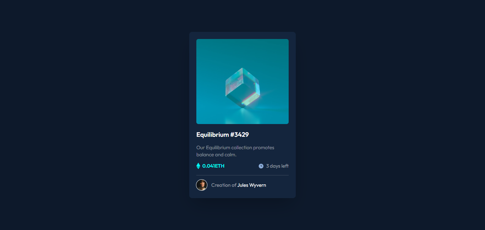
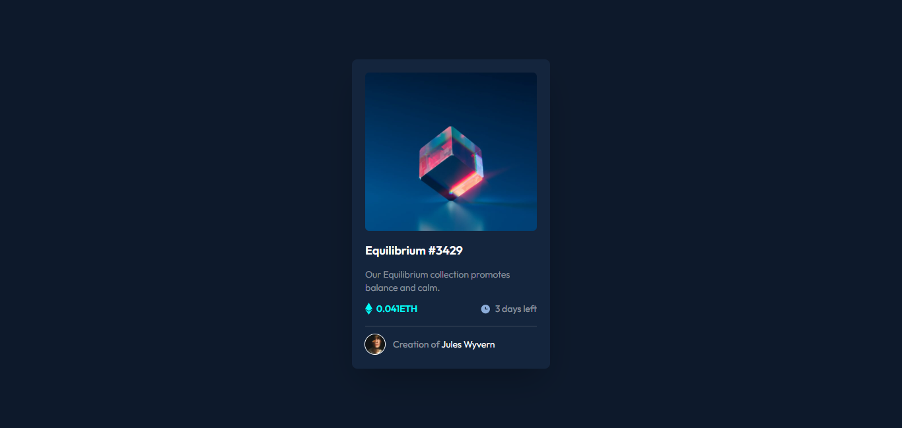

# Frontend Mentor - NFT preview card component solution

This is a solution to the [NFT preview card component challenge on Frontend Mentor](https://www.frontendmentor.io/challenges/nft-preview-card-component-SbdUL_w0U). Frontend Mentor challenges help you improve your coding skills by building realistic projects.

## Table of contents

- [Frontend Mentor - NFT preview card component solution](#frontend-mentor---nft-preview-card-component-solution)
  - [Table of contents](#table-of-contents)
  - [Overview](#overview)
    - [Screenshot](#screenshot)
    - [Links](#links)
    - [Built with](#built-with)
    - [What I learned](#what-i-learned)
    - [Continued development](#continued-development)
    - [Useful resources](#useful-resources)
  - [Author](#author)

## Overview

### Screenshot

### Links

- Solution URL: [GitHub Solution](https://github.com/unusualmide/NFT-preview-card-component-solution)
- Live Site URL: [GitHub Pages Live](https://unusualmide.github.io/NFT-preview-card-component-solution/)

### Built with

- Semantic HTML5 markup
- CSS custom properties
- Flexbox
- Mobile-first workflow
- Tailwind 

### What I learned

I learned how to blend more on how the dynamics of tailwind works hand in hand and the flexibility of its high level component

### Continued development

I will continue to use frontend mentor as I learn frontend development and design. For future development I look to get more into CSS grid for the more advanced layouts and landing page challanges  and also give me concept on how to tackle challenges 

### Useful resources

- [HTML Validator](https://validator.w3.org/) - This helped me for validation reason. I really liked this pattern and will use it going forward and help me crosscheck errors in my html code 
- [CSS Validator](https://jigsaw.w3.org/css-validator/) - This is an amazing stuff which helped me finally understand how to check errors im my code. I'd recommend it to anyone still learning this concept.

## Author

- Website - [Ayomide Ajilogba](https://www.your-site.com)
- Frontend Mentor - [@unusualmide](https://www.frontendmentor.io/profile/unusualmide)
